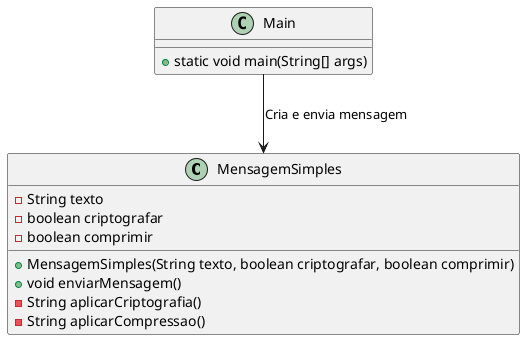
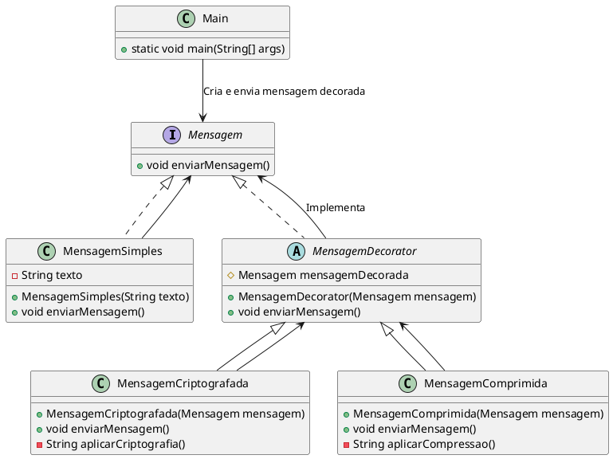

# Decorator

## Motivação
Imagine que uma empresa de transações financeiras online deseja garantir que suas notificações enviadas aos clientes sejam seguras e eficientes. Atualmente, o sistema envia apenas mensagens simples (públicas) para os clientes, como confirmações de pagamentos e alertas de segurança.

Porém, com o crescimento da empresa, novos requisitos foram adicionados:

Proteção de dados → As mensagens precisam ser criptografadas para evitar vazamento de informações sensíveis.
Otimização do tráfego → As mensagens devem ser comprimidas para reduzir o uso de largura de banda, especialmente para clientes que recebem várias notificações diariamente.
Extensibilidade → No futuro, pode ser necessário adicionar assinaturas digitais, traduções automáticas e outros recursos sem modificar o código original.

#### Problema:

Se fôssemos implementar cada funcionalidade diretamente na classe de mensagem (MensagemSimples), precisaríamos adicionar novos atributos e métodos dentro dela, aumentando sua complexidade e rigidez.

Além disso, cada combinação de funcionalidades (apenas criptografia, apenas compressão, ambas juntas, etc.) exigiria múltiplas versões da mesma classe, resultando em código difícil de manter e modificar.


  



#### Como o Composite Resolve o Problema:

O Decorator permite que adicionemos novas funcionalidades dinamicamente, sem modificar a classe original.
Podemos aplicar criptografia, compressão ou ambos de forma modular, além de permitir futuras expansões sem impactar a estrutura existente.

Quando um cliente recebe um alerta de segurança, a mensagem será criptografada antes de ser enviada.
Para notificações de marketing, que precisam ser entregues rapidamente e ocupam menos espaço, a mensagem será comprimida.
Para mensagens de faturas, onde é necessário garantir segurança e eficiência, utilizamos criptografia + compressão juntas.




### Estrutura 


### Participantes

- **Component (Mensagem)**
  - declara a interface para os objetos que podem ser decorados;
  - define a operação comum que pode ser alterada dinamicamente por decoradores.

- **ConcreteComponent (MensagemSimples)**
  - implementa a interface `Mensagem` e fornece a implementação básica da mensagem;
  - pode ser envolvida por decoradores para adicionar funcionalidades.

- **Decorator (MensagemDecorator)**
  - mantém uma referência para um objeto `Mensagem` e define a interface compatível;
  - delega as operações ao objeto decorado;
  - permite que novas responsabilidades sejam adicionadas dinamicamente.

- **ConcreteDecorator (MensagemCriptografada, MensagemComprimida)**
  - estendem `MensagemDecorator` e adicionam funcionalidades específicas;
  - modificam ou estendem o comportamento do `ConcreteComponent`.

- **Client (DecoratorDemo)**
  - cria objetos `MensagemSimples` e os envolve dinamicamente com decoradores;
  - utiliza a interface `Mensagem` para interagir com os objetos decorados.
### Exemplo: 

####  Interface Mensagem - Component

```java
public interface Mensagem {
    String enviar();
}
```

####  MensagemPublica  - ConcreteComponent
```java 
public class MensagemPublica implements Mensagem {
    private String conteudo;

    public MensagemPublica(String conteudo) {
        this.conteudo = conteudo;
    }
    
    @Override
    public String enviar() {
        return "Mensagem: " + conteudo;
    }
    
    
}
```

####  Decorator - MensagemDecorator
```java
public abstract class MensagemDecorator implements Mensagem {
    protected Mensagem mensagemDecorada;

    public MensagemDecorator(Mensagem mensagem) {
        this.mensagemDecorada = mensagem;
    }

    @Override
    public String enviar() {
        return mensagemDecorada.enviar();
    }
}

```

#### ConcreteDecorator (MensagemCriptografada, MensagemComprimida)

```java

public class MensagemCriptografada extends MensagemDecorator {
    public MensagemCriptografada(Mensagem mensagem) {
        super(mensagem);
    }

    @Override
    public String enviar() {
        return "Criptografada -> " + super.enviar();
    }
}

public class MensagemComprimida extends MensagemDecorator {
    public MensagemComprimida(Mensagem mensagem) {
        super(mensagem);
    }

    @Override
    public String enviar() {
        return "Comprimida -> " + super.enviar();
    }
}

```

#### Client (DecoratorDemo)
```java
public class DecoratorDemo {
    public static void main(String[] args) {
        // Criando uma mensagem simples
        Mensagem mensagem = new MensagemPublica("Olá, usuário!");
    
        // Decorando com criptografia
        Mensagem mensagemCriptografada = new MensagemCriptografada(mensagem);
        System.out.println(mensagemCriptografada.enviar());

        // Decorando com compressão
        Mensagem mensagemComprimida = new MensagemComprimida(mensagem);
        System.out.println(mensagemComprimida.enviar());

        // Aplicando os dois decoradores juntos (Criptografada e Comprimida)
        Mensagem mensagemCriptografadaEComprimida = new MensagemComprimida(new MensagemCriptografada(mensagem));
        System.out.println(mensagemCriptografadaEComprimida.enviar());
    }
}
```